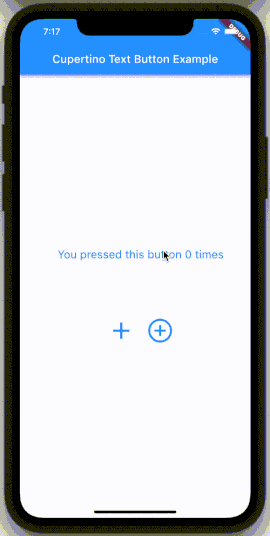

# Cupertino Text Button [![pub version][pub-version-img]][pub-version-url]

[![CodeFactor][code-factor--badge-url]][code-factor-app-url]

A button that looks like a Cupertino text button!



### Text Button

A simple text button can be created like this:

```dart
CupertinoTextButton(
    text: 'Apply',
    style: const TextStyle(fontSize: 20),
    onTap: () {
        // Do your text stuff here.
    },
),
```

For text buttons you can configure the following properties:

| Property | Type | Description |
| ------------- | ------------- | ------------- |
| text  | String | Title of the button |
| style  | TextStyle | Text style of the title |
| textAlign  | TextAlign | Text alignment of the button |
| textDirection  | TextDirection | The text direction to use for rendering the text |
| textOverflow  | TextOverflow | The text direction to use for rendering the text |
| softWrap  | bool | Whether the text should break at soft line breaks |

### Material Icon Button

A simple material icon button can be created like this:

```dart
CupertinoTextButton.materialIcon(
    icon: Icons.chevron_left,
    size: 30,
    onTap: () {
        // Do your icon stuff here.
    },
),
```

For material icon buttons you can configure the following properties:

| Property | Type | Description |
| ------------- | ------------- | ------------- |
| icon  | IconData | Icon to display |
| size  | double | Size of the icon |
| textDirection  | TextDirection | The text direction to use for rendering the icon |

### Common Properties

Either you creating a text or an icon button, you can specify these properties:

| Property | Type | Description |
| ------------- | ------------- | ------------- |
| onTap  | Function | On tap handler of the button |
| onLongPress  | Function | On long press handler of the button |
| normalColor  | Color | Foreground color of the button in normal state, e.g. not pressed |
| pressedColor  | Color | Foreground color of the button in pressed state |
| forwardDuration  | Duration | Duration of the animation from normalColor to pressedColor |
| backwardDuration  | Duration | Duration of the animation back from pressedColor to normalColor |
| curve  | Curve | The animation curve. |

### Theme

All these shared properties, except for the `onTap` and `onLongPress` ones, can be configured via the `CupertinoTextButtonTheme`. Just wrap it around your app or any other parent widget above `CupertinoTextButton`s in the tree like this:

```dart
CupertinoTextButtonTheme(
    normalColor: Colors.white,
    pressedColor: Colors.orange,
    /* forwardDuration, backwardDuration and curve can also be configured here. */
    child: Row(
        children: [
            CupertinoTextButton(
                text: 'First Option',
                style: const TextStyle(fontSize: 20),
                onTap: () {
                    // Do your first stuff here.
                },
            ),
            CupertinoTextButton(
                text: 'Second Option',
                style: const TextStyle(fontSize: 20),
                onTap: () {
                    // Do your second stuff here.
                },
            ),
        ],
    ),
)
```

And both of these text button will have the same colors!

If these properties are not specified in the button and no theme is provided, fallback values are used:

| Property | Fallback Value |
| ------------- | ------------- |
| normalColor  | Colors.black |
| pressedColor  | Theme*.primaryColor |
| forwardDuration  | const Duration(milliseconds: 20) |
| backwardDuration  | const Duration(milliseconds: 200) |
| curve  | Curves.fastOutSlowIn |

\* Theme — the default Flutter Theme.

[code-factor--badge-url]: https://www.codefactor.io/repository/github/nivisi/cupertino_text_button/badge?s=decf81989732c918fe71190d5afd2637c02e1816
[code-factor-app-url]: https://www.codefactor.io/repository/github/nivisi/cupertino_text_button
[pub-version-img]: https://img.shields.io/badge/pub-0.0.1-green
[pub-version-url]: https://pub.dev/packages/cupertino_text_button
